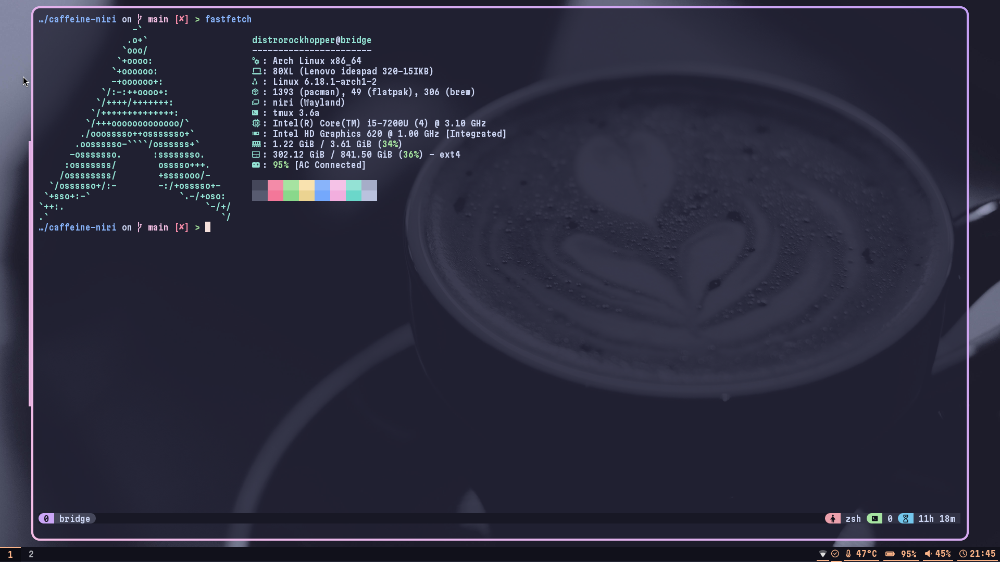

# caffeine-niri

**caffeine-niri** is a Niri rice I created, with Catppuccin Macchiato colors!

## Image


## Installation
There are *two methods* to install this rice

### Method 1 - Using [Dotkeeper](https://codeberg.org/StikyPiston/dotkeeper)

Firstly, ensure you have **Dotkeeper** installed. Install **Dotkeeper** with:

```bash
brew install stikypiston/formulae/dotkeeper
```

Then, run `dotkeeper fetch https://github.com/StikyPiston/caffeine-niri`

To activate the rice, ensure all dependencies are installed, and run `dotkeeper activate caffeine-niri`

### Method 2 - Manual Install

Run `git clone https://github.com/StikyPiston/caffeine-niri`

Copy the contents of `config` to `~/.config/`

Install any needed deps (Niri, waybar, wofi, fuzzel.), and there you go!
